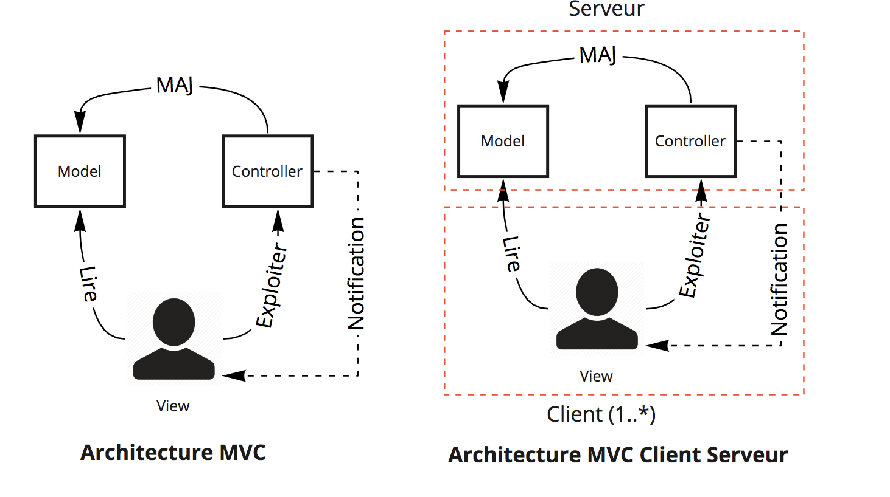
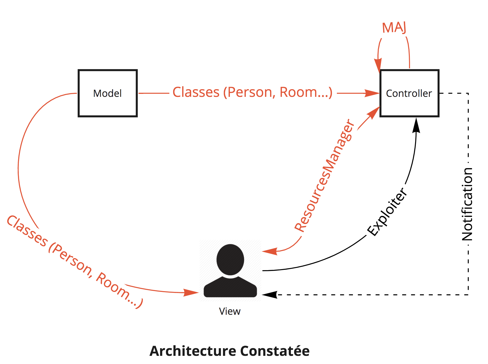
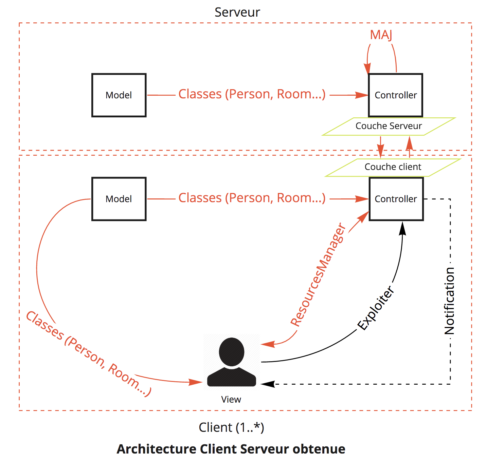

# Architecture
## MVC Client Serveur

## Architecture constatée

## Architecture obtenue

# Install
## Technical requirements
- access to internet
- have sudo privileges
## Install docker 
install docker (ubuntu)
````
sudo apt update -y && sudo apt install docker -y 
````
## install java 8 (openJDK won't work because javaFX dependencies)
````sh
sudo mkdir /opt/java-jdk/
wget http://enos.itcollege.ee/~jpoial/allalaadimised/jdk8/jdk-8u221-linux-x64.tar.gz
sudo tar zxvf jdk-8u221-linux-x64.tar.gz -c /opt/java-jdk/
sudo update-alternatives --install /usr/bin/java java /opt/java-jdk/jdk1.8.0_221/bin/java 1
sudo update-alternatives --install /usr/bin/javac javac /opt/java-jdk/jdk1.8.0_221/bin/javac 1
sudo update-alternatives --config java
# choose : /opt/java-jdk/jdk1.8.0_221/bin/java           1         manual mode
java -version
#expected 
#java version "1.8.0_221"
#Java(TM) SE Runtime Environment (build 1.8.0_221-b11)
#Java HotSpot(TM) 64-Bit Server VM (build 25.221-b11, mixed mode)
````
# Using release
## get & Deploy & Launch client-Server app 
````sh
wget https://github.com/ilyesAj/ressources/releases/download/0.1/release0.1.tar.gz
tar xvf release0.1.tar.gz 
cd server-deployment/
# For more details on server deployment and expected results refer to https://github.com/ilyesAj/ressources/tree/master/server-deployment
sudo ./deploy.sh
sudo ./launch.sh
# verify server working
sudo docker ps
cd ../client
sudo chmod +x client.jar
java -jar client.jar
````
## Stop & Delete server
````sh
sudo docker stop $(sudo docker ps -a -q)
sudo docker rm $(sudo docker ps -a -q)
````
## Remove docker image
````
sudo docker rmi arlo:server
````
## Remove app
````
rm -rf client/ server-deployment/ release0.1.tar.gz
````
# API
## Open API 
[swagger IU](https://app.swaggerhub.com/apis/ilyesAj/arlo/1.0.0?fbclid=IwAR2DQsu3hgSgAWDf9My-P_cgGShrTRksIPQbeyXEQsftARN2MiDd0KoabDk)
# REST API documentation 
[API](https://ilyesaj.github.io/swagger-ressources/)

API page is generated from this [Repo](https://github.com/ilyesAj/swagger-ressources)
# Custom config 
Default port for client and the server is `4567` , to modify this port you need to modify 2 files :
- Client side : modify `client/urlConfig.ini`
- Server side : modify `server-deployment/serverport.ini` 
Default bind is on `0.0.0.0` means that the server will be accessible from distant endpoint .you can modify this to be only for `localhost` by modifying `server-deployment/serverport.ini` 
# Troubleshoot
````
Exception in Application start method
Exception in thread "main" java.lang.RuntimeException: Exception in Application start method
````
solution : verify server connection and port synchronization ( server and client must have same port
````
Exception in thread "main" java.lang.NoClassDefFoundError: javafx/collections/FXCollections

````
solution : your java version is not supported : refer to install oracle-java 8 section 
# Exigences satisfaites
Req-arc-08 : Le système est composé de deux parties : un client présentant l'IHM et un serveur gérant les données (priorité 1) . 
Req-arc-09 : Le client et le serveur peuvent être déployés sur deux machines distinctes (priorité 1) . 
Req-arc-10 : La communication entre client et serveur passe par une API REST (priorité 1) . 
Req-arc-11 : Le port d'écoute du serveur est paramétrable via un fichier dans un format standard (XML, JSON, YAML ou INI) (priorité 2) . 
Req-arc-12 : Le serveur utilisé par le client est paramétrable via un fichier dans un format standard (XML, JSON, YAML ou INI) (priorité 2) . 
Req-arc-13 : Le déploiement du serveur passe par une unique commande (priorité 3).  
Req-arc-14 : Le démarrage du serveur passe par une unique commande (priorité 3).  
Req-arc-15 : L'arrêt du serveur passe par une unique commande (priorité 3).  
Req-arc-16 : L'API REST utilisée est exprimée en OpenAPI (priorité 4).  

